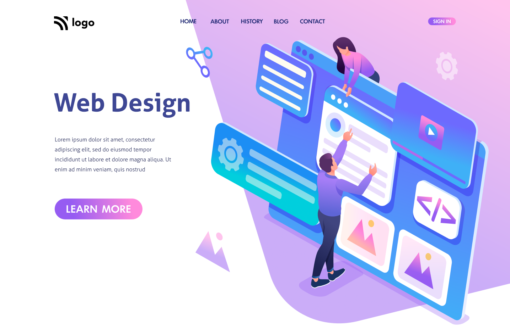

# Interior Design Landing Page  

## [Live Preview](#) :link:

## Project Goal :dart:

The Objective of this project was to style the webpage as shown in the mockup provided. Without modifying the html provided.

## Skills Gained

- Using and sizing and svg as `background-image`.
- Implementing `linear-gradient()`.

## Time Taken For Completion

```
 2.3 Hours
```

## Intended Outcome:



> This project is part of full stack Javascript web-dev bootcamp hosted by [iNeuron.](https://ineuron.ai/)
